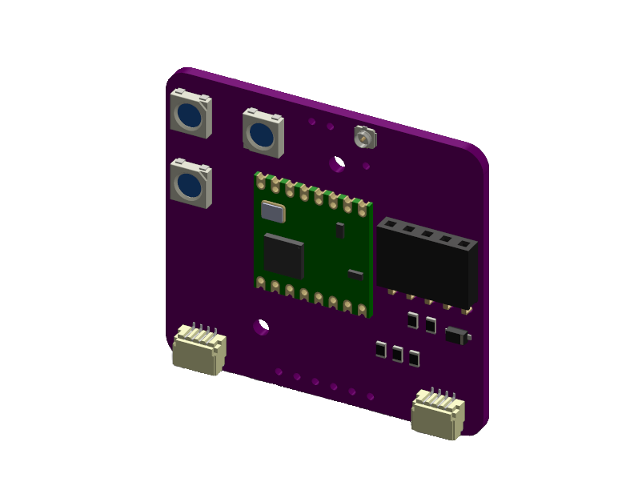

# LoRa Paw

  

The LoRa paw is an addon for the USB Nugget, giving it LoRa capabilities. It's based on the RFM95W module from HopeRF.

Interfacing with the LoRa paw is extremely easy, as libraries are available both in [CircuitPython](https://github.com/adafruit/Adafruit_CircuitPython_RFM9x) and [Arduino](https://github.com/sandeepmistry/arduino-LoRa).

You can order one today from [our store](https://retia.io/products/lora-breakout-for-usb-nugget).

!!! note
    If you have one of our V1 Prototypes that look like the picture below, please refer to this [GitHub](https://github.com/RetiaLLC/RFM95w_LoRa_Nugget) for pinouts and example code. The design has been updated, and they are not supported in this guide.
    
