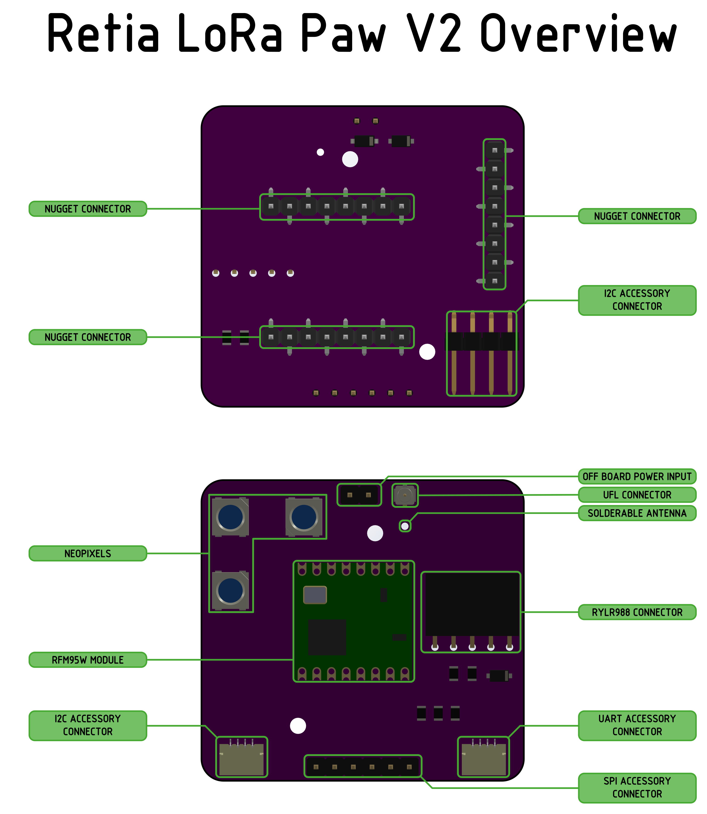
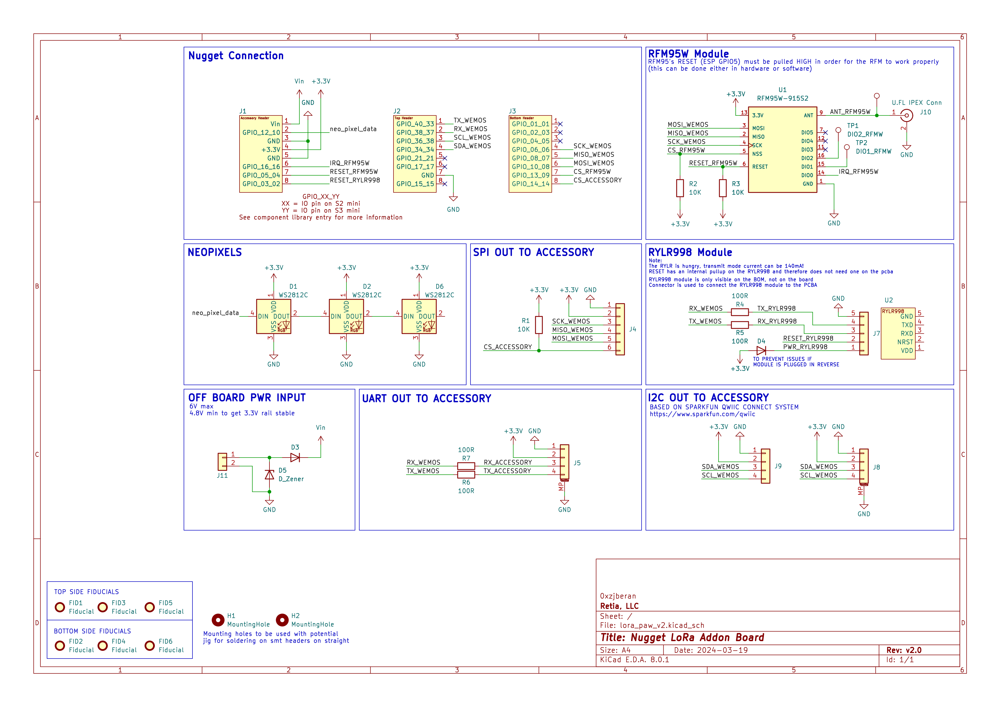

# Schematics

=== "Definitions"

    
    Component Definitions for the LoRa Paw

=== "Schematic"

    
    Schematic for the LoRa Paw
    
    [Download](../assets/lora_paw_v2.pdf){ .md-button }
    
